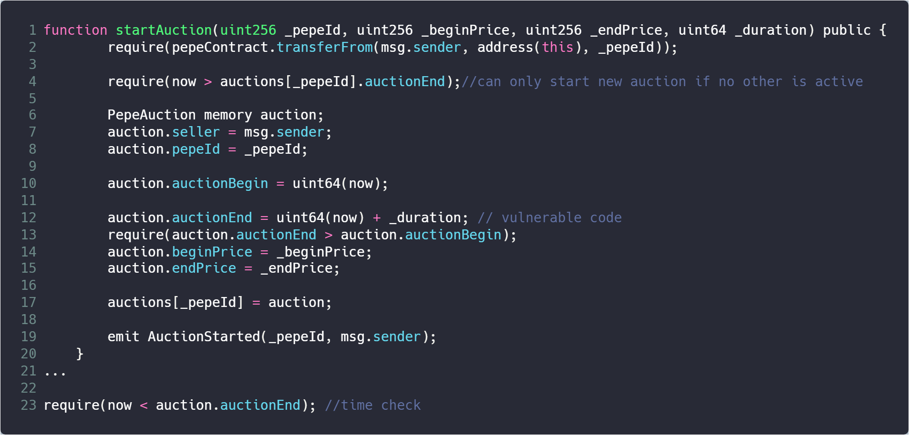

### Vender

### Deployment Address

0x28ae3DF366726D248c57b19fa36F6D9c228248BE

0x84aC94F17622241f313511B629e5E98f489AD6E4

0xBC2AFc039d2BFa67d582aC181daB5BE17EC91f82

0xD4dd63D658f603E9a0Aa381E103e05457Cd5E609

0xE2C43d2C6D6875c8F24855054d77B5664c7e810f

### Code Details

https://cn.etherscan.com/address/0x28ae3df366726d248c57b19fa36f6d9c228248be#code	#220-240 #339

https://cn.etherscan.com/address/0x84ac94f17622241f313511b629e5e98f489ad6e4#code	#591-611 #742

https://cn.etherscan.com/address/0xbc2afc039d2bfa67d582ac181dab5be17ec91f82#code 	#591-611 #742

https://cn.etherscan.com/address/0xd4dd63d658f603e9a0aa381e103e05457cd5e609#code	#845-865 #996

https://cn.etherscan.com/address/0xe2c43d2c6d6875c8f24855054d77b5664c7e810f#code 	#220-240 #371

### Vulnerable Code

### Description

We found this contract has a possible ineffectiveness in time check. In line 23, this contract has a time check (in line 335 for real code). This check relies on the value of the member auctionEnd. However, the auctionEnd is assigned in line 12 (in line 228 for real code) by an argument _duration. This function is feasible for public access and there's no argument check on this _duration variable. If a very large number is assigned to _duration, the time check in line 23 will be easily passed.

### Suggestions

Check the _duration value before assign it to auctionEnd.

