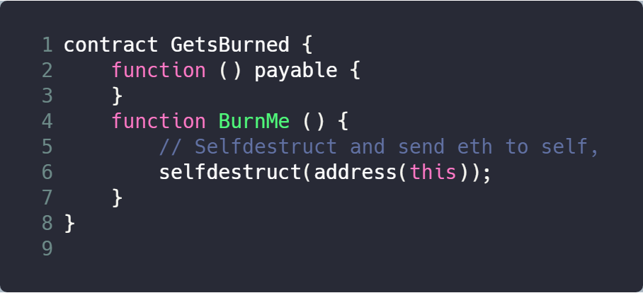

### Vender

### Deployment Address

0x0e532f97012693945Bc073068a7D94501FC37dC5

### Code Details

https://cn.etherscan.com/address/0x0e532f97012693945bc073068a7d94501fc37dc5#code #10-13

### Vulnerable Code

### Description

This contract provide a suicidal function. When other contracts invoke this function, the balances of contracts will be transfered to the contract. 

In this GetsBurned contract, function BurnMe provides a suicidal functionality. This suicidal procedure is simple and straight-forward, without any checks on the target address, thus provides the possibility for hackers to design a malicious code to steal ethers.

### Suggestions

Check transaction address instead of using this for transfer target.
