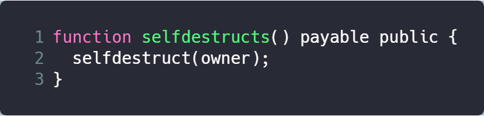

### Vender

ICOVO

### Deployment Address

0x4Ea0Df261BA584572CDED3F2E35a0E63375Ac4f1

### Code Details

<https://etherscan.io/address/0x4Ea0Df261BA584572CDED3F2E35a0E63375Ac4f1>

### Vulnerable Code

### Description

This contract provide a suicidal function. When other contracts invoke this function, the balances of contracts will be transfered to the contract. 

In this function, selfdestructs provides a suicidal functionality. This suicidal procedure is simple and straight-forward, without any checks on the target address, thus provides the possibility for hackers to design a malicious code to steal ethers.

### Suggestions

Check transaction address instead of using owner for transfer target.
