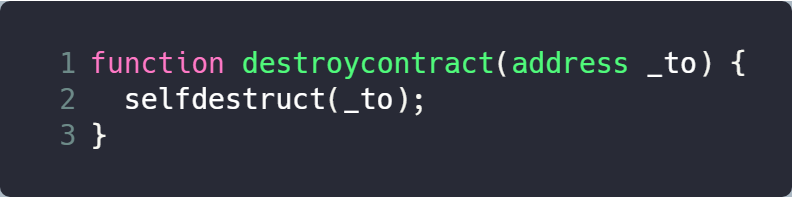

### Vender

0xRACER

### Deployment Address

0xEe045942b043B92cca0c454a553649EaA80873ea

### Code Details

<https://etherscan.io/address/0xEe045942b043B92cca0c454a553649EaA80873ea>

### Vulnerable Code

### Description

This contract provide a suicidal function. When other contracts invoke this function, the balances of contracts will be transfered to the contract. 

In this function, destroycontract provides a suicidal functionality. This suicidal procedure is simple and straight-forward, without any checks on the target address, thus provides the possibility for hackers to design a malicious code to steal ethers.

### Suggestions

Check transaction address instead of using _to for transfer target.