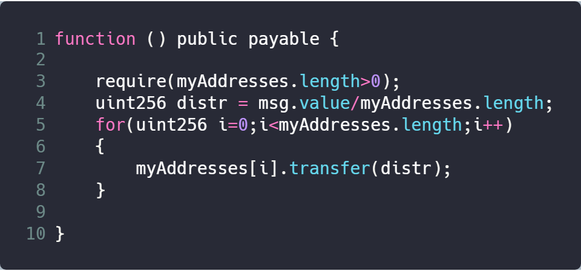

### Vender

Aeroneum

### Deployment Address

0xbD1554A482100463b1CC6696554e4E393E7B8CE7

### Code Details

<https://etherscan.io/address/0xbD1554A482100463b1CC6696554e4E393E7B8CE7>

### Vulnerable Code

### Description

The contract contains a fallback function, and it has a transfer call in for loop at line 7 (at line 234 for real code). Placing transfer function in a loop will leave a DoS (Denial of Service) attack. A hacker can participate a transaction and stops the process of transfering ethers to other innocents when the transfer operation happens.

The transfer operation is a high level call in Solidity. It first transfers ethers with limited gas consumption, then return a bool value. The return value will be false if it failed and revert will be invoked. Though other transfer operations remain unfinished, the whole execution process will be stopped. This can be leveraged by attackers to achieve a DoS attack. The Solidity development document suggests that developers should not put transfer in loops (for, while, etc.).

### Suggestions

Do not put transfer in loops.
