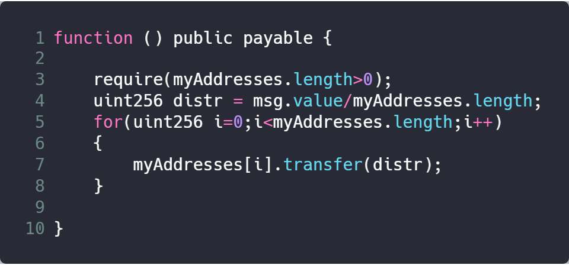

### Vender

Rob The Bank

### Deployment Address

0xD0955bD45d5EeF5BEdCe84a3471c825288a14b01

### Code Details

<https://etherscan.io/address/0xd0955bd45d5eef5bedce84a3471c825288a14b01>

### Vulnerable Code

### Description

This contract provide a suicidal function. When other contracts invoke this function, the balances of contracts will be transfered to the contract. 

In this GetsBurned contract, function BurnMe provides a suicidal functionality. This suicidal procedure is simple and straight-forward, without any checks on the target address, thus provides the possibility for hackers to design a malicious code to steal ethers.

### Suggestions

Check transaction address instead of using this for transfer target.
